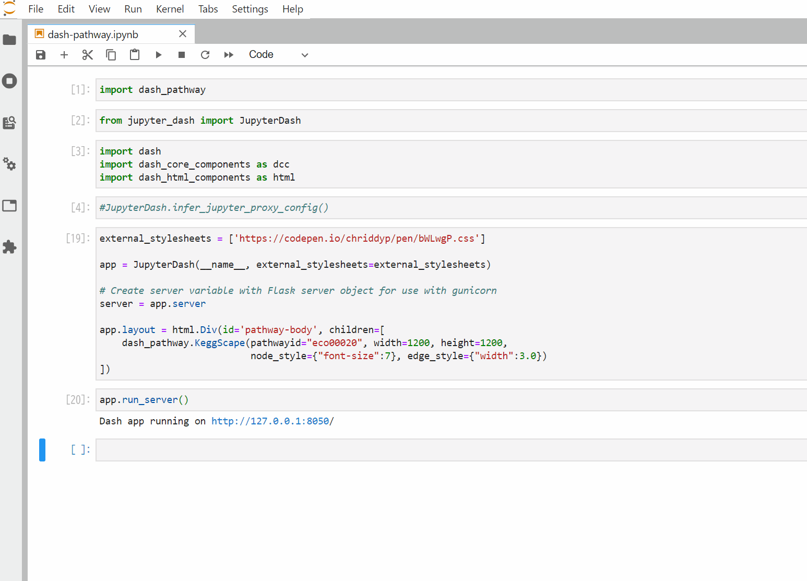

# dash-pathway
[](https://mybinder.org/v2/gh/ecell/dash-pathway/master?filepath=notebooks)
[](https://badge.fury.io/py/dash-pathway)

A Dash component for pathway visualization, wrapped around [Dash Cytoscape](https://github.com/plotly/dash-cytoscape)



## Installing dash-pathway
```
pip install git+https://github.com/ecell/kegg2cyjs
pip install git+https://github.com/ecell/dash-pathway
```

## Trying dash-pathway with [jupyter-dash](https://github.com/plotly/jupyter-dash)

```
from jupyter_dash import JupyterDash
import dash
import dash_core_components as dcc
import dash_html_components as html
import dash_pathway

external_stylesheets = ['https://codepen.io/chriddyp/pen/bWLwgP.css']
app = JupyterDash(__name__, external_stylesheets=external_stylesheets)
server = app.server

app.layout = html.Div(id='pathway-body', children=[
    dash_pathway.KeggScape(pathwayid="eco00010")
])

app.run_server()
```
