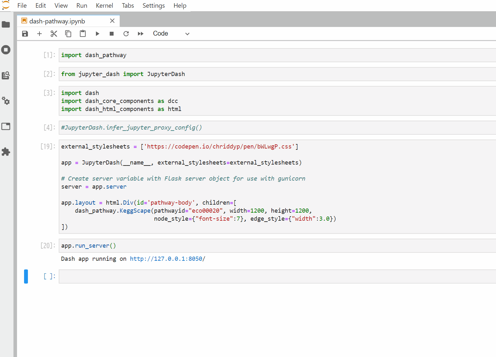
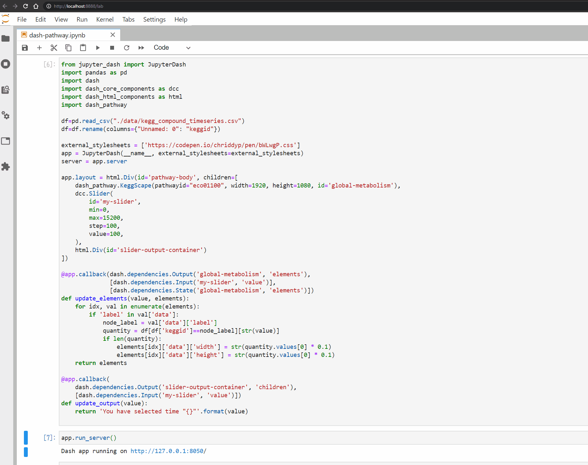

# dash-pathway
[](https://mybinder.org/v2/gh/ecell/dash-pathway/master?filepath=notebooks)
[](https://badge.fury.io/py/dash-pathway)

A dash component for pathway visualization, wrapped around [dash-cytoscape](https://github.com/plotly/dash-cytoscape)



## Getting Started in JupyterLab

### Prerequisites
Make sure that dash and jupyter dependent libraries are correctly installed:
```
conda install pandas pip
conda install -c conda-forge jupyterlab
conda install -c conda-forge -c plotly jupyter-dash
```

### Usage
Install the library using `pip`:
```
pip install dash-pathway
```

Run the following command in your terminal to run JupyterLab:
```
jupyter lab
```

Run the following cell inside JupyterLab cell: (This reproduces the visualization like animated gif at the beginning.)
```
from jupyter_dash import JupyterDash
import dash
import dash_core_components as dcc
import dash_html_components as html
import dash_pathway

external_stylesheets = ['https://codepen.io/chriddyp/pen/bWLwgP.css']
app = JupyterDash(__name__, external_stylesheets=external_stylesheets)
server = app.server

app.layout = html.Div(id='pathway-body', children=[
    dash_pathway.KeggScape(pathwayid="eco00020", width=1200, height=1200,
                           node_style={"font-size":14}, edge_style={"width":10.0})
])

app.run_server()
```

### Advanced Usage
dash-pathway not only allows you to visualize pathways, but also maps and integrates data into pathways.

In the example below, we have mapped the quantitative values of a compound's time series onto KEGG global metabolism map.
The size of compound nodes in the metabolism map increase or decrease in size depending on the amount of the mapped quantitative value.
And we used the dash slider component to change the quantitative value of each time series.

This allows us to determine how the abundance of compounds in which pathway function changes over time.

```
from jupyter_dash import JupyterDash
import pandas as pd
import dash
import dash_core_components as dcc
import dash_html_components as html
import dash_pathway

df=pd.read_csv("./data/kegg_compound_timeseries.csv")
df=df.rename(columns={"Unnamed: 0": "keggid"})

external_stylesheets = ['https://codepen.io/chriddyp/pen/bWLwgP.css']
app = JupyterDash(__name__, external_stylesheets=external_stylesheets)
server = app.server

app.layout = html.Div(id='pathway-body', children=[
    dash_pathway.KeggScape(pathwayid="eco01100", width=1920, height=1080, id='global-metabolism'),
    dcc.Slider(
        id='my-slider',
        min=0,
        max=15200,
        step=100,
        value=100,
    ),
    html.Div(id='slider-output-container')
])

@app.callback(dash.dependencies.Output('global-metabolism', 'elements'),
              [dash.dependencies.Input('my-slider', 'value')],
              [dash.dependencies.State('global-metabolism', 'elements')])
def update_elements(value, elements):
    for idx, val in enumerate(elements):
        if 'label' in val['data']: 
            node_label = val['data']['label']
            quantity = df[df['keggid']==node_label][str(value)]
            if len(quantity):
                elements[idx]['data']['width'] = str(quantity.values[0] * 0.1)
                elements[idx]['data']['height'] = str(quantity.values[0] * 0.1)
    return elements

@app.callback(
    dash.dependencies.Output('slider-output-container', 'children'),
    [dash.dependencies.Input('my-slider', 'value')])
def update_output(value):
    return 'You have selected time "{}"'.format(value)

app.run_server()
```


